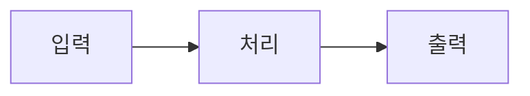
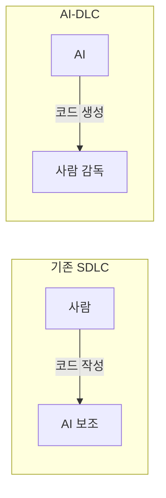

# Reference: LO 콘텐츠 작성 가이드라인

LO는 **강의 자료로 바로 사용할 수 있는 수준**으로 작성한다.

## 섹션 작성 규칙

각 이론 섹션은 다음 구조를 따른다:

```markdown
### 섹션 제목

[설명 텍스트 - 2~3문단, 충분한 맥락 제공]

> 💡 **핵심 포인트**: 청중이 반드시 기억해야 할 한 줄

```mermaid
[다이어그램 - 개념 시각화]
```

| 비교표/정리표 |

> 📚 **출처**: [제목](URL) - 간단한 설명
```

## 출처 명시 규칙

| 상황 | 형식 |
|------|------|
| 개념/정의 인용 | 섹션 끝에 `> 📚 **출처**: [제목](URL)` |
| 직접 인용 | 블록 인용 `> "인용문" - 출처` |
| 이미지/다이어그램 | 캡션에 출처 표기 |

## Mermaid 다이어그램 규칙

### 기본 규칙

1. **Mermaid 사용** (Obsidian 렌더링 지원)
2. 모든 주요 개념에 시각 자료 포함
3. 다이어그램 유형:
   - 프로세스/흐름: `flowchart`
   - 순서/단계: `sequenceDiagram`
   - 구조/관계: `graph` 또는 `classDiagram`

### Mermaid 노드 텍스트 규칙 (중요!)

Obsidian에서 Mermaid 파싱 오류를 방지하기 위해:

| 피해야 할 패턴 | 문제 | 올바른 대안 |
|--------------|------|-----------|
| `[1. 자율성]` | 숫자+점이 리스트로 인식됨 | `[자율성]` 또는 `[1-자율성]` |
| `["한글 따옴표"]` | 유니코드 따옴표 파싱 오류 | `[한글 따옴표]` (따옴표 제거) |
| `["텍스트"]` 노드 안 따옴표 | 파싱 오류 가능성 | `[텍스트]` (따옴표 없이) |
| `[긴 텍스트<br/>줄바꿈]` 복잡한 경우 | 파싱 오류 가능성 | `[긴 텍스트 줄바꿈]` (한 줄로) |

**안전한 패턴**:
- 노드 텍스트는 단순하게: `A[자율성] --> B[도구 사용]`
- subgraph 제목에는 따옴표 사용 가능: `subgraph "MCP 영역"`
- 복잡한 설명은 노드 외부(마크다운 텍스트)에서



## 텍스트 깊이 기준

| 요소 | 기준 |
|------|------|
| 개념 설명 | 2~3문단 (배경 + 정의 + 의미) |
| 핵심 포인트 | 1줄 (암기할 수준) |
| 비교표 | 3개 이상 항목 비교 시 필수 |
| 코드 예시 | 주석으로 각 줄 설명 |

## 콜아웃 사용

```markdown
> 💡 **핵심 포인트**: 반드시 기억할 내용
> ⚠️ **주의**: 흔한 실수나 오해
> 🔗 **연결**: 다른 개념과의 관계
> 📚 **출처**: 참고 자료
```

## 예시: 잘 작성된 섹션

```markdown
### 1. AI-DLC란?

AI-DLC(AI-Driven Development Life Cycle)는 AWS에서 2024년 제안한
AI 중심 소프트웨어 개발 방법론이다. 기존 SDLC가 사람이 코드를 작성하고
AI가 보조하는 방식이었다면, AI-DLC는 AI가 실행하고 사람이 감독하는
패러다임 전환을 제안한다.

이 방법론의 핵심은 "AI Powered Execution with Human Oversight"로,
개발자의 역할이 코드 작성자에서 AI 감독자로 변화함을 의미한다.

> 💡 **핵심 포인트**: AI-DLC = AI가 실행, 사람이 감독



> 📚 **출처**: [AWS AI-DLC Blog](https://aws.amazon.com/blogs/devops/ai-driven-development-life-cycle/) - AWS DevOps 블로그, 2024
```

---

# LO 중복 방지

## 두 가지 중복 유형

| 유형 | 설명 | 예시 |
|------|------|------|
| **제목 중복** | 같은 주제의 LO가 이미 존재 | LO-MCP 아키텍처 vs LO-MCP 구조 |
| **내용 중복** | 다른 LO에서 같은 개념을 설명 | "AI-DLC란?" 설명이 2개 LO에 중복 |

## 제목 중복 검사

새 파일을 만들기 전에 같은 접두사의 기존 파일을 찾아 제목이 겹치는지 확인합니다. Glob으로 파일 목록을 얻고, Grep으로 제목 키워드를 검색합니다.

1. **기존 파일 목록 확인** — Glob 도구로 접두사별 파일을 모읍니다.
   - LO: `Glob "**/LO-*.md"`
   - 커리큘럼: `Glob "**/CU-*.md"`
   - 프로젝트: `Glob "**/PR-*.md"`

2. **제목 키워드 검색** — 만들려는 제목의 핵심 키워드로 Grep을 돌려 유사 제목이 있는지 봅니다.
   - 예: `Grep "MCP" --glob "**/LO-*.md" -l` 로 "MCP"가 들어간 LO 파일 경로를 찾습니다.
   - 한 단어로 부족하면 동의어·약어를 추가로 검색합니다(예: "아키텍처", "구조").

3. **유사도 판단** — 검색 결과의 파일명과 제목(frontmatter `title` 또는 첫 헤딩)을 비교해, 같은 주제를 다른 표현으로 쓴 중복인지 판단합니다. 의심되면 해당 파일을 읽어 확인합니다.

## 내용 중복 방지 (핵심)

**작성 전 확인 사항:**

1. **관련 커리큘럼 읽기**
   - 해당 LO가 속할 커리큘럼 파일 읽기
   - 커리큘럼의 LO 구성에서 각 LO의 **역할/범위** 파악

2. **관련 LO 스캔**
   - 같은 커리큘럼 내 다른 LO들의 "핵심 개념" 섹션 확인
   - 중복 가능성 있는 개념 목록화

3. **경계 조정**
   - 개요 LO: 개념 간 **관계**만 설명, 상세는 링크
   - 상세 LO: 해당 개념의 **깊이 있는** 내용만

## 중복 발견 시 처리

| 상황 | 처리 방법 |
|------|----------|
| 다른 LO에서 상세히 다룸 | `→ [[LO-X]]에서 자세히 다룬다` 링크 참조 |
| 공통 기초 개념 | notes/에 별도 노트로 분리 후 양쪽에서 링크 |
| 관점이 다름 | 차이점 명시 후 작성 (예: "여기서는 실습 관점에서...") |

## 경계 조정 질문 (AskUserQuestion)

```
"이 LO는 [개념]을 다루려 합니다.
[[LO-X]]에서 이미 다루고 있는데, 어떻게 할까요?

(A) 여기서는 링크만 참조
(B) 다른 관점에서 다룸 (차이점: ___)
(C) 기존 LO 내용을 여기로 이동
```

## 커리큘럼 선행 업데이트 원칙

**LO는 커리큘럼의 일부다.** LO 내용을 작성하기 전에 커리큘럼에서 해당 LO의 역할을 먼저 정의한다.

```
올바른 순서:
1. 커리큘럼에 LO 목록과 각 LO의 역할 정의
2. 각 LO의 경계/범위 명확화
3. LO 내용 작성

잘못된 순서:
1. LO 내용 먼저 작성
2. 나중에 커리큘럼에 추가
→ 내용 중복, 경계 모호 발생
```

**커리큘럼(CU-) LO 구성 예시:**

```markdown
## LO 구성

| 순서 | LO | 역할/범위 | 유형 |
|------|-----|----------|------|
| 1 | [[LO-AI 시대 개발 방법론 개요]] | 전체 그림, 개념 간 **관계** | 이론 |
| 2 | [[LO-AI-DLC 방법론]] | AI-DLC **상세** (3단계, Mob) | 이론 |
| 3 | [[LO-Spec-Driven Development]] | 명세 작성법 **상세** | 이론 |
```

> 💡 Obsidian에서 `[[LO-` 입력 시 자동완성으로 빠르게 필터링

→ "역할/범위" 열이 각 LO의 경계를 명확히 정의

---

# 최신 정보 검색 가이드

커리큘럼/LO 생성 시 **반드시 최신 정보를 검색**하여 내용에 반영한다.

## 검색 시점

- 새 커리큘럼 생성 시: 주제 관련 최신 트렌드
- LO 내용 작성 시: 개념별 최신 정보, 통계, 사례

## 검색 대상

| 유형 | 검색 키워드 예시 | 신뢰할 수 있는 출처 |
|------|----------------|-------------------|
| 기술 트렌드 | "[기술명] 2025 trends enterprise" | Gartner, McKinsey, IBM |
| 프로토콜/표준 | "[프로토콜명] official documentation" | 공식 문서, GitHub |
| 시장 전망 | "[기술명] market forecast adoption" | Forrester, IDC |
| 사례 연구 | "[기술명] case study enterprise" | 기업 블로그, 학술 자료 |

## 검색 결과 활용

```markdown
> 📚 **출처**: [제목](URL) - 출처명, YYYY
```

## 주의사항

- 1년 이상 된 정보는 최신 정보와 교차 검증
- 블로그/미디엄 등은 공식 출처로 보완
- 통계/수치는 반드시 출처 명시
