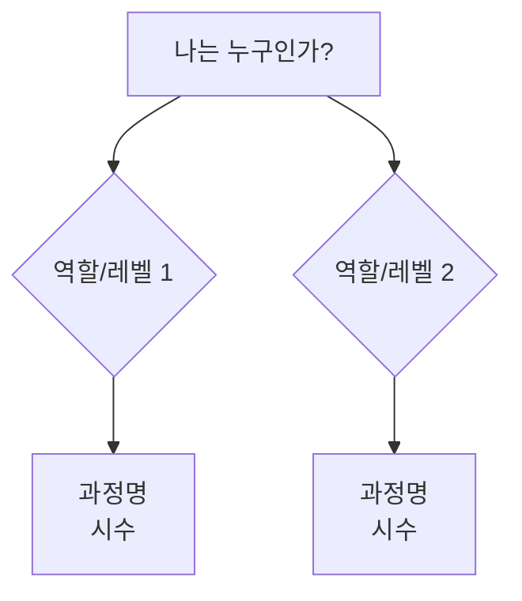

# CAT 템플릿

**위치:** `education/catalogs/CAT-{주제}-{연도}/CAT-{주제}-{연도}.md` (항상 폴더)
**역할:** 여러 CU를 묶는 상위 단위. 영업/제안/운영에 필요한 정보를 한곳에 집약.

## 명명 규칙

| 유형 | 명명 | 예시 |
|------|------|------|
| **범용** | `CAT-{주제}-{연도}` | `CAT-AI 실무 마스터-2026` |
| **기관** | `CAT-{주제}-{기관}-{연도}` | `CAT-DS College-KTDS-2026` |

## 폴더 구조

```
CAT-{이름}/
├── CAT-{이름}.md           ← 본문 (아래 템플릿)
├── roadmap/                ← 로드맵 이미지, 프롬프트
├── typst/                  ← Typst 소스 + PDF 렌더링
└── archive/                ← 이전 버전
```

```markdown
---
created: YYYY-MM-DD
updated: YYYY-MM-DD
tags: [catalog, education]
status: 준비중
client: ""
period: ""
version: "1.0"
---

# CAT-주제-연도

## 카탈로그 개요

| 항목 | 내용 |
|------|------|
| **타이틀** |  |
| **목적** |  |
| **대상 기관** |  |
| **총 과정 수** |  |
| **총 시수** |  |
| **총 일수** |  |
| **운영 기간** |  |

## 과정 목록

| # | 과정 (CU) | 시수 | 일수 | 대상 | 레벨 | 상태 |
|---|-----------|------|------|------|------|------|
| 1 | [[CU-]] |  |  |  |  |  |
| 2 | [[CU-]] |  |  |  |  |  |

## 선택 가이드

대상별/레벨별 추천 경로.



## 학습 경로

### 경로 1: (경로명)

1. **과정A** — 선수 없음
2. **과정B** — 과정A 권장
3. **과정C** — 과정B 필수

### 경로 2: (경로명)

1. **과정D** — 선수 없음
2. **과정E** — 과정D 권장

### 과정 간 의존성

| 심화 과정 | 선수 권장 | 선수 필수 |
|----------|----------|----------|
|  |  |  |

## 일정 템플릿

### 집중 편성 (1주)

| 일차 | 과정 | 시수 |
|------|------|------|
| 1일차 |  |  |
| 2일차 |  |  |
| 3일차 |  |  |
| 4일차 |  |  |
| 5일차 |  |  |

### 분산 편성 (격주/월간)

| 회차 | 날짜 | 과정 | 시수 |
|------|------|------|------|
| 1회 |  |  |  |
| 2회 |  |  |  |

### 최소 편성 (핵심만)

| 과정 | 시수 | 비고 |
|------|------|------|
|  |  | 필수 |
|  |  | 선택 |

## 납품 이력

| 기관 | 기간 | 과정 수 | 시수 | 비고 |
|------|------|---------|------|------|
|  |  |  |  |  |

## 차별화 포인트

- **강점1**: 설명
- **강점2**: 설명
- **강점3**: 설명

## 도구 및 환경 요구사항

### 전체 과정 공통

| 도구 | 용도 | 필수 여부 | 비고 |
|------|------|----------|------|
|  |  |  |  |

### 과정별 추가 도구

| 과정 | 추가 도구 | 비고 |
|------|----------|------|
|  |  |  |

### 인프라 조건

- [ ] (네트워크, 서버, 계정 등)

## 가격 가이드

| 구분 | 시수 | 단가 | 비고 |
|------|------|------|------|
| 개별 수강 |  |  |  |
| 패키지 (전체) |  |  | 할인율 |
| 패키지 (선택) |  |  |  |

## 커스터마이징 옵션

### 교체 가능한 과정

| 기본 과정 | 대체 가능 과정 | 조건 |
|----------|--------------|------|
|  |  |  |

### 시수 조절 범위

| 과정 | 최소 | 표준 | 최대 | 비고 |
|------|------|------|------|------|
|  |  |  |  |  |

### 추가 가능 과정

| 과정 | 시수 | 대상 | 비고 |
|------|------|------|------|
|  |  |  |  |
```

## 작성 가이드

### 카탈로그 개요
- 한눈에 전체 규모와 목적을 파악할 수 있도록 작성
- client가 특정 기관이면 해당 기관 맥락에 맞춤

### 과정 목록
- CU는 반드시 wikilink로 연결
- 상태: 준비중, 완료, draft
- 기존 CU가 없는 과정은 상태를 "draft (미생성)"으로 표기

### 선택 가이드
- Mermaid flowchart로 시각화
- 역할(개발자/비개발자/테크리더 등)과 레벨(입문/중급/심화)로 분기

### 일정 템플릿
- 최소 2가지 편성안 제시 (집중/분산)
- 기관 일정에 맞춰 유연하게 조절 가능함을 명시

### 가격 가이드
- 패키지 할인 기준을 명확히
- 커스터마이징 시 가격 변동 범위 포함

### 커스터마이징 옵션
- 교체/추가/제거 가능한 과정을 명시하여 제안 유연성 확보
