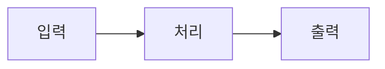

# LO-학습 목표 제목

> 파일명: `los/LO-제목.md`
> **문체**: 격식체(합쇼체). 해요체/반말 금지.

## 학습 목표

> 이 LO를 완료하면 학습자는...

- [ ] ~를 이해할 수 있다
- [ ] ~를 설명할 수 있다
- [ ] ~를 구현할 수 있다

## 핵심 개념

> 이 LO에서 다루는 개념들

- (주요 개념/기술)

## 이론 내용

### 1. 주요 내용 1

[설명 텍스트 - 2~3문단, 충분한 맥락 제공]

> **핵심 포인트**: 청중이 반드시 기억해야 할 한 줄

| 항목 | 설명 |
|------|------|
| | |

> **출처**: [제목](URL) - 간단한 설명

### 2. 주요 내용 2

[설명 텍스트 - 2~3문단]

> **핵심 포인트**:

> **출처**: [제목](URL)

## 체크포인트

- [ ] (확인 사항 1)
- [ ] (확인 사항 2)

## 참고 자료

| 자료 | 설명 |
|------|------|
| [제목](URL) | 용도/내용 |

## 사용된 커리큘럼

> 이 LO를 포함하는 커리큘럼 목록 (`[[CU-...]]`)

-
