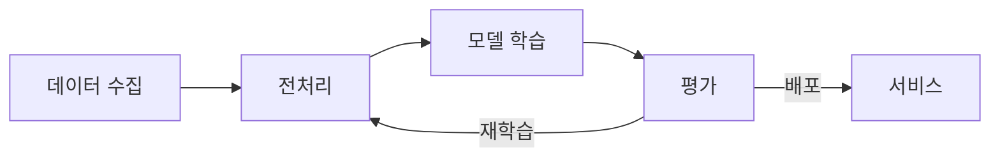

# Diagram Builder Skill

다이어그램을 직접 생성(Draw.io, Mermaid)하거나, 외부 도구용 프롬프트(나노바나나)로 연계하는 스킬.

---

## 도구 선택

| 도구 | 방식 | 적합한 경우 |
|------|------|------------|
| **Draw.io** | XML 직접 생성 → PNG | 정밀 레이아웃 필요, 편집 가능한 기술 다이어그램 |
| **Mermaid** | 코드 → 마크다운 인라인 | 시퀀스, 간단 흐름도, 문서 내 인라인 |
| **이미지 생성** | → `image-gen` 스킬 | 비주얼 퀄리티 중시, 개념도, 프레젠테이션용 |

### 자동 분기 규칙

| 사용자 표현 | 도구 |
|------------|------|
| "Draw.io로", "drawio", ".drawio" | Draw.io |
| "머메이드", "mermaid", "시퀀스 다이어그램" | Mermaid |
| "나노바나나", "예쁘게", "이미지로" | → `image-gen` 스킬 |
| "아키텍처", "배포도", "컴포넌트" | Draw.io (기본) |
| "플로우차트", "흐름도" | Mermaid (기본) |
| **애매한 경우** | AskUserQuestion으로 선택지 제공 |

### 애매한 경우 선택지

```
AskUserQuestion:
  "어떤 도구로 다이어그램을 만들까요?"
  - Draw.io — 정밀 레이아웃, 편집 가능 (.drawio → PNG)
  - Mermaid — 마크다운 인라인, 코드 기반
  - 이미지 생성 — AI 이미지 생성 (비주얼 중심)
```

> 비주얼 퀄리티가 중요한 이미지가 필요하면: 이 스킬을 종료하고 `image-gen` 스킬을 사용한다. (인포그래픽, 개념도, 프레젠테이션용 삽화)

---

## Draw.io 워크플로우

### 1. 요구사항 분석

- 다이어그램 유형 결정 (시스템 아키텍처, 데이터 플로우, 컴포넌트, 배포)
- 요소 목록과 연결 관계 파악
- 복잡도 판단: 요소 5개 이하 = 개별, 6개 이상 = 그룹 기반

### 2. 레이아웃 설계

> Read `workflows/layout.md` for details

- **연결 기반 배치**: 연결 대상에 가까운 쪽에 요소 배치 -> 화살표 최소화
- **수직 정렬**: 연결되는 요소 쌍의 X좌표를 동일하게 -> 직선 화살표
- **그룹 기반**: 복잡한 시스템은 그룹 + 대표 화살표로 단순화

### 3. 디자인 토큰 적용

> Read `workflows/tokens.md` for details

핵심 기본값:

| 항목 | 값 |
|------|-----|
| 캔버스 | 1100 x 600, gridSize=10 |
| 여백 | 40px (상하좌우) |
| 요소 간격 | 수평 20px, 수직 15px |
| 레이어 간격 | 20px |
| 폰트 | 제목 20, 레이어 11, 박스 10, 범례 8 |

### 4. 화살표 연결

> Read `workflows/arrows.md` for details

**필수 규칙**:
- 모든 화살표에 `exitX/Y`, `entryX/Y` 명시
- 레이어 간: `exitX=0.5;exitY=1;entryX=0.5;entryY=0`
- 수평: `exitX=1;exitY=0.5;entryX=0;entryY=0.5`
- 다중 화살표 겹침 방지: Y좌표 6-8px씩 분리
- 점선은 요소 위를 지나가지 않음 -> 외곽 우회

### 5. 스타일 적용

> Read `workflows/styles.md` for details

**색상 퀵 레퍼런스**:

| 역할 | fill / stroke |
|------|---------------|
| AI/Core | #0050ef / #001DBC (white text) |
| Database | #60a917 / #2D7600 (white text) |
| Service | #f8cecc / #b85450 |
| Client/UI | #fff2cc / #d6b656 |
| Infrastructure | #b0e3e6 / #0e8088 |
| Background | #f5f5f5 / #666666 |

### 6. PNG 변환

```bash
/Applications/draw.io.app/Contents/MacOS/draw.io \
  --export --format png --scale 2 \
  --output "output.png" "input.drawio"
```

| 옵션 | 설명 |
|------|------|
| `--scale 2` | 2x 해상도 (권장) |
| `--format svg` | SVG 출력 |
| `--transparent` | 투명 배경 |

---

## Mermaid 워크플로우

마크다운 문서에 인라인으로 삽입하거나 별도 `.mmd` 파일로 저장.

### 지원 유형

| 유형 | 키워드 |
|------|--------|
| `flowchart` | 흐름도, 프로세스 |
| `sequenceDiagram` | 시퀀스, API 호출 |
| `classDiagram` | 클래스, 관계도 |
| `stateDiagram-v2` | 상태 전이 |
| `gantt` | 일정, 타임라인 |
| `erDiagram` | ER, 데이터 모델 |
| `pie` | 비율, 분포 |

### 작성 규칙

1. 마크다운 코드블록으로 감싸기: ` ```mermaid ... ``` `
2. 노드 텍스트에 한글 사용 가능 (따옴표로 감싸기)
3. 방향 명시: `TB` (위→아래), `LR` (좌→우)

### 예시



### PNG 변환 (선택)

```bash
npx @mermaid-js/mermaid-cli mmdc -i input.mmd -o output.png -t dark -b transparent
```

---

## Quality Checklist

### 레이아웃
- [ ] 모든 요소가 캔버스 경계 안에 위치
- [ ] 같은 유형 요소는 동일 크기
- [ ] 간격이 일관됨 (10px 단위)
- [ ] 레이어 요소가 수평 정렬됨

### 화살표
- [ ] 모든 화살표에 exitX/Y, entryX/Y 명시
- [ ] 겹치거나 교차하는 화살표 없음
- [ ] 1:N 분기 시 출구점 분산

### 스타일
- [ ] 색상 팔레트 일관성
- [ ] 폰트 크기 규칙 준수
- [ ] 충분한 색상 대비

---

## Anti-patterns

| 피해야 할 것 | 권장 |
|-------------|------|
| exitX/Y 미지정 | 모든 화살표에 명시 |
| 요소 크기 불일치 | 같은 유형은 같은 크기 |
| 불균일한 간격 | 10px 단위 정렬 |
| 화살표 교차 | 요소 위치 조정 또는 waypoint |
| 너무 많은 색상 | 팔레트 내 색상만 사용 |
| 캔버스 벗어남 | 여백 40px 확보 |
| 예약어 ID 사용 | `filter` -> `filter-agent` 등으로 변경 |

---

## 출력 경로

| 프로젝트 | 경로 |
|----------|------|
| proposals/ | `assets/diagrams/` |
| reports/ | `assets/diagrams/` 또는 `diagrams/png/` |
| books/ | `images/` |
| slides/ | `assets/` |

---

## 참조 파일

| 파일 | 내용 |
|------|------|
| `workflows/tokens.md` | 캔버스, 요소 크기, 간격, 선, 폰트 상세 |
| `workflows/arrows.md` | 화살표 좌표계, waypoint, 점선 라우팅 |
| `workflows/layout.md` | 연결 기반 배치, 수직 정렬, 그룹 레이아웃 |
| `workflows/styles.md` | 색상 팔레트, 폰트, XML 패턴, 예약 ID |
| `templates/` | system-architecture, data-flow, component, deployment |

## 연계 스킬

| 스킬 | 관계 |
|------|------|
| `image-gen` | 비주얼 중심 다이어그램(개념도, 프레젠테이션용) 생성 |
| `slide-builder` | 슬라이드 내 다이어그램 삽입 |
