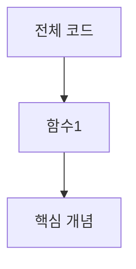

# 코드 분석 노트 템플릿

```markdown
---
created: YYYY-MM-DD
updated: YYYY-MM-DD
tags: [learning, code-analysis]
source: 파일 경로 또는 출처
language: python | typescript | ...
learned-from: [[세션 노트 링크]]
---

# [코드/라이브러리명] 분석

## 전체 구조

- 목적:
- 주요 함수/클래스:

## 섹션별 분석

### [섹션/함수명]

```코드 블록```

**이 부분이 하는 일:**
-

**핵심 개념:**
- 개념1: 설명
- 개념2: 설명

**더 알아야 할 것:**
- [[개념 링크]]

## 탐구 경로



## 배운 점

-

## 다음에 알아볼 것

- [ ]
```
