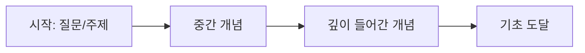
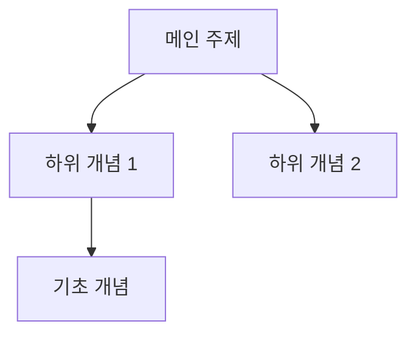

# Context Extraction 노트 템플릿

```markdown
---
created: YYYY-MM-DD
updated: YYYY-MM-DD
tags: [learning, conversation-extract]
source: conversation
topic: 주요 학습 주제
---

# YYYY-MM-DD 대화 학습: [주제]

## 탐구 경로



**경로 요약:**
1. [시작점] - 처음 궁금했던 것
2. [중간] - 알게 된 것들
3. [도달점] - 최종 이해

## 핵심 개념

| 개념 | 한 줄 정의 | 어떤 맥락에서 |
|------|-----------|--------------|
| 개념1 | ... | Q1에서 등장 |
| 개념2 | ... | Q2에서 등장 |

## 질문-답변 기록

### Q1: [원래 질문 그대로]

**왜 물었나:** 질문의 배경/동기

**핵심 답변:**
> 요약된 핵심 내용

**상세 내용:**
- 포인트 1
- 포인트 2

**관련 개념:** [[개념1]], [[개념2]]

---

### Q2: [후속 질문]

...

## 개념 관계도



## 인사이트

- **깨달음 1:** ...
- **깨달음 2:** ...

## 다음에 알아볼 것

- [ ] 미해결 질문 1
- [ ] 더 깊이 볼 주제
- [ ] 관련해서 실습해볼 것

## 관련 노트

- [[기존 관련 노트]]
```
