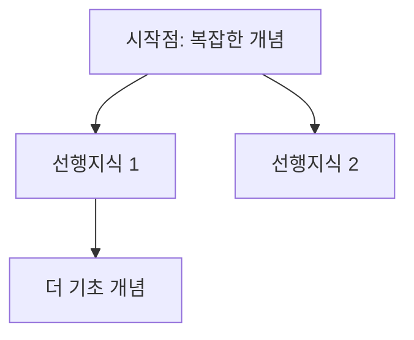

# 학습 세션 노트 템플릿

```markdown
---
created: YYYY-MM-DD
updated: YYYY-MM-DD
tags: [learning, session]
topic: 학습 주제
duration: 시간 (분)
review-dates: [YYYY-MM-DD, ...]
---

# YYYY-MM-DD 학습: [주제]

## 학습 목표

-

## 탐구 경로



## 배운 개념들

### 개념 1
-

### 개념 2
-

## 질문과 답변

### Q1:
**A:**

## 다음에 더 알아볼 것

- [ ]

## 복습 체크

- [ ] 1일 후 (YYYY-MM-DD)
- [ ] 3일 후 (YYYY-MM-DD)
- [ ] 7일 후 (YYYY-MM-DD)
- [ ] 30일 후 (YYYY-MM-DD)
```
